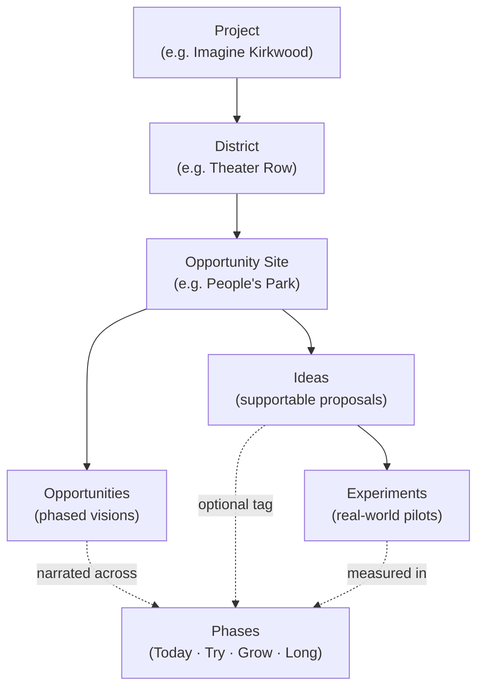
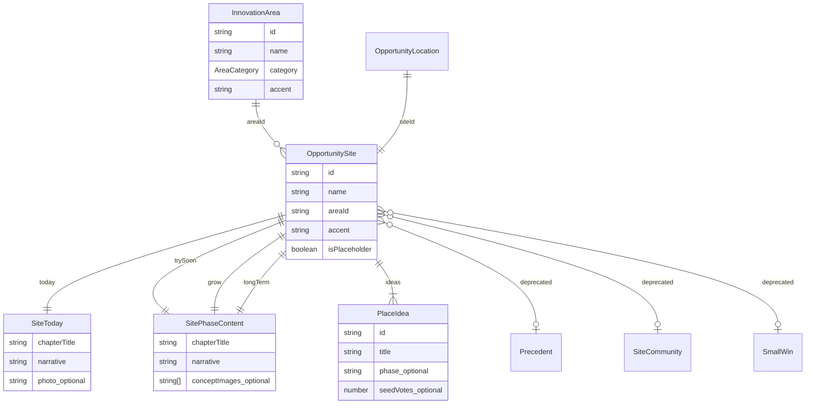
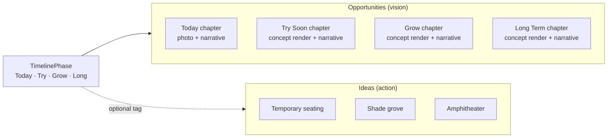
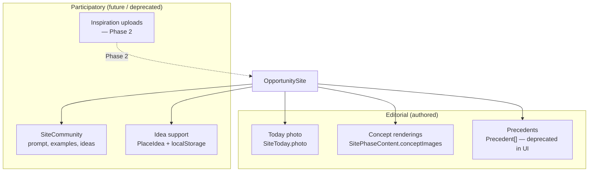
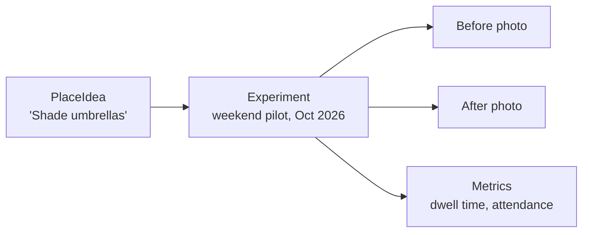

# Data Model

Imagine Kirkwood is organized around **places** and **time**. A visitor opens a spot on the map, sees what it is like today, scrubs through futures, and supports ideas they want to see tried. The data model exists to keep those experiences honest: separate *what we might want* from *when we might build it*, and separate *editorial story* from *community signal*.

This document describes the **conceptual architecture**, the **implemented types** in `lib/types.ts`, and how **images, precedents, renderings, and community content** fit together.

For product phasing, see [`roadmap.md`](roadmap.md). For design rules, see [`product-principles.md`](product-principles.md).

---

## Conceptual hierarchy

At full maturity, the platform stacks like this:



| Layer | What it represents | Kirkwood pilot example |
|-------|-------------------|------------------------|
| **Project** | A city or corridor deployment of the platform | Imagine Kirkwood (Bloomington) |
| **District** | A walkable zone — editorial context, not the primary click target | Theater Row, Parklet Promenade |
| **Opportunity Site** | A named public place people recognize on the ground | People's Park, Library Plaza |
| **Opportunities** | The phased *visions* for what a site could become | Today photo + Try / Grow / Long narratives |
| **Ideas** | Discrete, supportable proposals attached to a site | "Shade grove," "Pop-up stage" |
| **Experiments** | Real-world pilots that test an idea on the ground | *(Phase 3 — not yet in code)* |
| **Phases** | The shared timeline axis: as-is → try soon → grow → long term | `TimelinePhase` |

**Phases are not a bucket you dump content into at the bottom of the tree.** They are a **cross-cutting timeline** that primarily organizes *Opportunities* (vision chapters). Ideas may reference a phase; experiments will eventually document outcomes across phases.

---

## What exists in code today



| Conceptual layer | Code location | Status |
|------------------|---------------|--------|
| Project | Implicit (single deployment) | Not modeled yet |
| District | `InnovationArea` in `lib/data/innovation-areas.ts` | Implemented; de-emphasized in UI |
| Opportunity Site | `OpportunitySite` in `lib/data/opportunity-sites.ts` | Implemented |
| Map position | `OpportunityLocation` in `lib/map/opportunity-locations.ts` | Implemented |
| Opportunities | `today`, `trySoon`, `grow`, `longTerm` on `OpportunitySite` | Implemented |
| Ideas | `PlaceIdea[]` on `OpportunitySite` | Implemented |
| Experiments | — | Planned (Phase 3) |
| Phases | `TimelinePhase` + `TIMELINE_PHASES` | Implemented |

---

## Why implementation phases are separate from ideas

**Opportunities** answer: *What could this place feel like over time?*  
**Ideas** answer: *What specific thing might we do here?*

**Phases** answer: *When might that happen — and at what level of commitment?*

Collapsing these causes the product problems we are trying to fix: duplicate bullet lists in every phase chapter, arguments about oak trees before anyone agrees shade matters, and support buttons attached to entire master plans instead of discrete proposals.



### How they differ in practice

| | **Opportunities (phase chapters)** | **Ideas** |
|---|-----------------------------------|-----------|
| **Purpose** | Inspire — show a coherent future | Align — signal what to try first |
| **Cardinality** | One chapter per phase per site | Many per site, one unified list |
| **UI location** | `PhaseChapter` — changes when user scrubs time | `PlaceIdeasSection` — stable list below vision |
| **User action** | Explore, compare futures | Support (local MVP) |
| **Content shape** | Hero image + title + one narrative | Title + optional description + phase pill |
| **Phase binding** | Each chapter *is* a phase | Optional `phase` tag — not a duplicate list per phase |

### Editorial rule

Write **one sentence of vision per phase**. Put **specific proposals in `ideas[]`**. Do not repeat the ideas list inside `improvements[]` on phase chapters — that field remains in the type for legacy data but is **not rendered** in the current panel.

---

## The `OpportunitySite` model

An **Opportunity Site** is the atomic unit of the exhibition: a named place with a map marker, a slide-out panel, phased stories, and a list of ideas.

### Type definition

```typescript
interface OpportunitySite {
  id: string;           // URL-safe key; matches OpportunityLocation.siteId
  name: string;         // Display name on map and panel
  areaId: string;       // FK → InnovationArea.id (district context)
  accent: string;     // Phase glow + panel accent color
  today: SiteToday;
  trySoon: SitePhaseContent;
  grow: SitePhaseContent;
  longTerm: SitePhaseContent;
  ideas: PlaceIdea[];
  isPlaceholder?: boolean;
  // Deprecated — not rendered:
  precedents?: Precedent[];
  community?: SiteCommunity;
  smallWins?: SmallWin[];
}
```

### Field guide

| Field | Role |
|-------|------|
| `id` | Stable identifier across content, images, map, and localStorage vote keys |
| `name` | Human-readable place name — leads the panel, not district jargon |
| `areaId` | Links to an `InnovationArea` for block-scale context (optional in UI) |
| `accent` | CSS `--hero-accent`; marker phase glow |
| `today` | **Observe** — current conditions: photo + chapter title + narrative |
| `trySoon` | **Imagine / Experiment** — low-cost future: concept image + narrative |
| `grow` | **Grow** — proven directions scaled: concept image + narrative |
| `longTerm` | **Grow** — civic ambition: concept image + narrative |
| `ideas` | **Support** — merged, deduplicated proposals with optional `seedVotes` |
| `isPlaceholder` | Story stub — phase filter locked to Today; empty ideas state |

### `PlaceIdea`

```typescript
interface PlaceIdea {
  id: string;
  title: string;
  description?: string;
  phase?: "try-soon" | "grow" | "long-term";  // optional hint, not a container
  seedVotes?: number;                            // editorial starting count
}
```

Support counts in the UI: `seedVotes + 1` when the visitor has supported that idea on this device (`lib/ideas/votes.ts`).

### Phase content types

Both `SiteToday` and `SitePhaseContent` extend **`PhaseChapterFields`**:

```typescript
interface PhaseChapterFields {
  chapterTitle: string;
  narrative: string;
  improvements: string[];   // legacy — do not render
  timeline: string;         // legacy — do not render
  investment: string;       // legacy — do not render
  confidence: string;       // legacy — do not render
}
```

**`SiteToday`** adds observation-era fields used in data but pared back in UI:

- `photo` — today hero (`/images/opportunities/{siteId}/today/street.jpg`)
- `stats`, `observations`, `description` — optional; not rendered in current panel

**`SitePhaseContent`** adds future-era fields:

- `conceptImages[]` — phase hero renders (`/images/opportunities/{siteId}/{phase}/hero.webp`)
- `paragraphs[]` — extra copy; not rendered in current panel

### Resolving phase content

```typescript
getPhaseContent(site, phase: TimelinePhase): SiteToday | SitePhaseContent
```

Used by `SiteDetail` and `PhaseChapter` when the user changes the in-panel filter or global `PhaseScrubber`.

---

## Districts (`InnovationArea`)

Districts provide **block-scale orientation** on the map — gateway, gathering, shared street — without replacing place-first navigation.

```typescript
interface InnovationArea {
  id: string;
  block: string;
  name: string;
  category: AreaCategory;
  accent: string;
  geometry: AreaGeometry;   // SVG polygon — overlay hidden in current map
  chapterIntro: string;
}
```

Each `OpportunitySite` references a district via `areaId`. The panel **no longer shows** the innovation-area eyebrow; places lead with their own names.

---

## Map layer (`OpportunityLocation`)

Map positions are **decoupled** from site content so the same content model can power different cities or map crops:

```typescript
interface OpportunityLocation {
  siteId: string;       // → OpportunitySite.id
  x: number;            // 0–100% of map width
  y: number;            // 0–100% of map height
  label: string;
  labelAlign?: "left" | "right" | "center";
  labelOffset?: { x: number; y: number };
}
```

Percent coordinates convert to SVG viewBox units via `toViewBoxPoint()` in `lib/map/opportunity-locations.ts`.

---

## Images, precedents, renderings, and community content

Media and participatory content play different roles. They should not compete for the same screen space.



### Today photography

| | |
|---|---|
| **Purpose** | Ground imagination in reality — "what it looks like now" |
| **Field** | `SiteToday.photo` |
| **Convention** | `/images/opportunities/{siteId}/today/street.jpg` |
| **Helper** | `getSitePhotoPath(siteId)` in `lib/images.ts` |
| **Rendered by** | `TodayPhoto` → `PhaseChapter` when `activePhase === "today"` |

### Concept renderings

| | |
|---|---|
| **Purpose** | Show a plausible future — one hero per phase, not a bullet list |
| **Field** | `SitePhaseContent.conceptImages[]` (first image used as hero) |
| **Convention** | `/images/opportunities/{siteId}/{try-soon\|grow\|long-term}/hero.webp` |
| **Helper** | `getSiteConceptImage(siteId, phase)` in `lib/concepts.ts` |
| **Rendered by** | `SiteConceptHero` → `PhaseChapter` for Try / Grow / Long |

Renderings are **vision**, not **commitment**. They pair with a single narrative sentence — not timeline, investment, or confidence metadata in the public panel.

### Precedents

| | |
|---|---|
| **Purpose** | Learn from other cities — widen the menu of options |
| **Field** | `Precedent[]` on site (deprecated optional) |
| **Shape** | `{ id, place, summary, image? }` |
| **Convention** | `/images/opportunities/{siteId}/precedents/{01\|02\|03}.jpg` |
| **Helper** | `getPrecedentImagePath(siteId, index)` in `lib/images.ts` |
| **UI status** | Removed from panel in pare-back sprint; may return as optional discovery depth |

Precedents are **stories from elsewhere**, not ideas for this site. They inform; they are not supportable proposals.

### Community content

| | |
|---|---|
| **Purpose** | Neighbor voice — inspiration, examples, contributed ideas |
| **Field** | `SiteCommunity` (deprecated optional): `prompt`, `examples[]`, `ideas[]` |
| **UI status** | Removed from panel; inspiration uploads planned for Phase 2 |
| **Replacement direction** | `PlaceIdea[]` for editorial + supportable ideas; uploads and collections for user-generated content |

Legacy `SiteCommunity.ideas` overlapped with `PlaceIdea[]`. The merged **`ideas`** array is the single source of truth for supportable proposals going forward.

### Deprecated overlap (migration notes)

| Legacy source | Merged into |
|---------------|-------------|
| `smallWins[]` | `ideas[]` with `phase: "try-soon"` |
| `community.ideas[]` | `ideas[]` |
| Phase `improvements[]` bullets | `ideas[]` (titles deduplicated) |
| `precedents[]` | Unchanged in type; reintroduce separately from ideas |

---

## Experiments (planned)

Experiments are **not yet modeled in code**. In Phase 3 they will link an **idea** to a **real-world pilot**:



An experiment record will likely include: hypothesis, dates, partners, cost range, status, before/after media, and measured outcomes — without conflating community **support** with official **approval**.

---

## Project layer (planned)

Today the Kirkwood pilot is implicit — one city, one atlas, one content file. Phase 4 will introduce an explicit **Project** entity:

```typescript
// Aspirational — not yet implemented
interface Project {
  id: string;
  name: string;              // "Imagine Kirkwood"
  city: string;
  districts: InnovationArea[];
  sites: OpportunitySite[];
  mapConfig: { aerialPath: string; viewBox: string };
}
```

Multiple projects share types and components; content and map config swap per deployment.

---

## File reference

| File | Contents |
|------|----------|
| `lib/types.ts` | All core interfaces and `TIMELINE_PHASES` |
| `lib/data/opportunity-sites.ts` | Site content array; `getOpportunitySiteById`, `getPhaseContent` |
| `lib/data/innovation-areas.ts` | District definitions |
| `lib/map/opportunity-locations.ts` | Marker positions |
| `lib/map/aerial.ts` | Base map image and viewBox |
| `lib/map/exhibit-treatment.ts` | Editorial spotlight SVG defs |
| `lib/concepts.ts` | Concept image path helper |
| `lib/images.ts` | Photo and precedent path helpers |
| `lib/ideas/votes.ts` | Client-side support persistence |

---

## Content authoring checklist

When adding or editing an `OpportunitySite`:

1. Assign a unique `id` and matching `OpportunityLocation.siteId`.
2. Write **one narrative sentence** per phase (`today`, `trySoon`, `grow`, `longTerm`).
3. Add **today photo** and **three concept heroes** under `/images/opportunities/{id}/`.
4. Merge proposals into **`ideas[]`** — ~8 deduplicated items with optional `phase` and `seedVotes`.
5. Do **not** populate `improvements[]`, `smallWins`, or `community.ideas` for new content.
6. Set `isPlaceholder: true` until all four phases and ideas are editorially complete.

---

## Mental model (one paragraph)

A **Project** deploys the platform for a city. **Districts** orient visitors on the map. **Opportunity Sites** are the places people care about. **Opportunities** are the phased visions told in the panel hero. **Ideas** are the supportable proposals beneath that vision. **Experiments** will prove ideas on the ground. **Phases** are the shared clock — Today, Try, Grow, Long — that organizes vision without swallowing the ideas list.

Keep visions inspiring. Keep ideas actionable. Keep phases honest about time and commitment.
